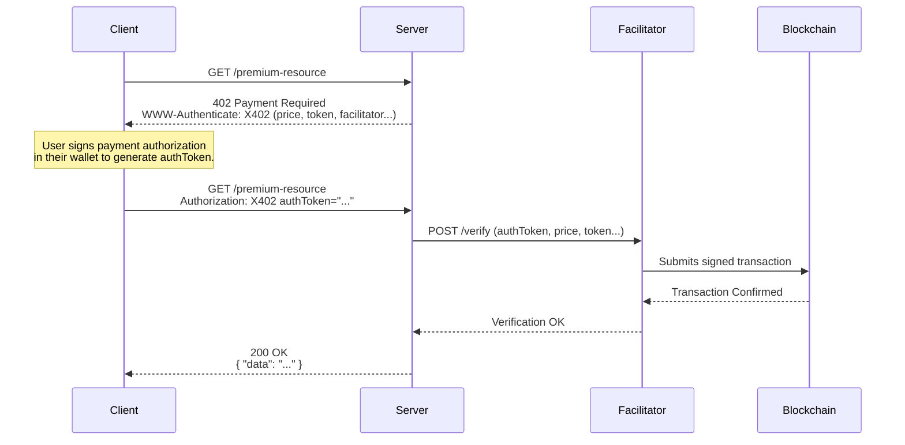

<div align="center">
  
</div>

# LedgerFlow

**Making value flow as freely, efficiently, and borderlessly as information flow.**

LedgerFlow is a modern payment gateway built on blockchain technology, centered around stablecoins (such as USDC). We aim to solve the pain points of current mainstream payment systems (such as Stripe), including high registration barriers, opaque fees, account freezing risks, and difficult appeals.

By leveraging blockchain's transparency, security, and composability, LedgerFlow provides SaaS service providers, developers, and independent creators worldwide with a **low-barrier, low-cost, high-efficiency, censorship-resistant** payment solution.

## 🔥 First-class x402 Protocol Support (EVM)

- Standards-based paywalls using x402 V1 "exact" with USDC EIP-3009.
- Settlement via PaymentVault.depositWithAuthorization preserves on-chain `DepositReceived(payer, orderId, amount)` linkage.
- Distributed `orderId` equals the EIP-3009 `nonce` (no central issuance).
- See details: [Exact scheme notes](./docs/scheme_exact_evm.md)

x402 workflow



## Testnet(Unichain Sepolia) Demo

* PaymentVault Contract: [0x8b6f22009ae835795b9b33d75ad218c730db039b](https://sepolia.uniscan.xyz/address/0x8b6f22009ae835795b9b33d75ad218c730db039b)
* Telegram Bot: [@LedgerFlowBot](https://t.me/LedgerFlowBot)
* USDC Faucet: <https://faucet.circle.com/>
* Unichain Faucet: <https://docs.unichain.org/docs/tools/faucets>
* MVP Demo video: <https://youtu.be/YedfwqCenMQ>

## Aptos Testnet Demo

* PaymentVault Contract: [0xd2b5bb7d81b7fa4eeae1b5f6d6a8e1f9cdc738189a1dcc2315ba4bb846](https://aptoscan.com/account/0xd2b5bb7d81b7fa4eeae1b5f6d6a8e1f9cdc738189a1dcc2315ba4bb846?network=testnet)
* Deposit tx: [0x93e242a077c1424b1ff64e2dfafd7b965a77ed4f4f381e74615a76b1c14a7e58](https://aptoscan.com/transaction/6812053128?network=testnet)
* Withdraw tx: [0x28a2e327961686fdaa0e3bf1ea5ef1a342019044fe161b7ea9d61417e4c1e38b](https://aptoscan.com/transaction/6812054574?network=testnet)

## Arch

<div align="center">
  
</div>

## 🎯 Problems We Solve

Current centralized payment gateways, while powerful, have inherent flaws that create barriers for emerging digital economies and global collaboration:

- **High Entry Barriers**: Must register a company entity to open an account, excluding many independent developers and small teams
- **Account Freezing Risk**: Platforms have unilateral power to freeze accounts, lack of fund security guarantees, lengthy and low-success appeal processes
- **Complexity & Learning Costs**: Integrating traditional payment systems requires significant learning costs and development resources
- **Geographic & Banking Restrictions**: Business scope limited to supported countries and banking systems, cannot achieve true global coverage
- **Opaque Fees**: Hidden currency conversion fees, cross-border transaction fees make final costs unpredictable

## 🚀 Our Solution

LedgerFlow fundamentally solves these problems through the Web3 technology stack:

### Core Advantages

- **Permissionless**: Anyone with an EVM address can start receiving payments immediately, no company registration required
- **Self-Custody**: Funds go directly into on-chain Vault contracts you control, platform cannot freeze or misappropriate funds
- **Truly Global**: Can receive payments anywhere in the world with internet connection, no geographic restrictions
- **Transparent Fees**: Fees only include predictable blockchain network Gas fees, no hidden charges
- **Simple & Decoupled**: Easy integration through simple APIs, business systems completely decoupled from on-chain funds

## 🏗️ System Architecture

LedgerFlow uses a lightweight decoupled architecture consisting of the following core components:

```text
ledgerflow/                         # Project root directory
├── ledgerflow-vault-evm/           # EVM smart contracts (PaymentVault)
│   ├── src/                        # Solidity contract source code
│   ├── test/                       # Contract tests (Foundry)
│   ├── script/                     # Deployment scripts
│   └── ...                         # EVM contract-related files
├── ledgerflow-vault-aptos/         # Aptos smart contracts (PaymentVault)
│   ├── sources/                    # Move contract source code
│   ├── tests/                      # Contract tests
│   ├── scripts/                    # Deployment scripts
│   └── ...                         # Aptos contract-related files
├── ledgerflow-balancer/            # Backend service (business logic core)
├── ledgerflow-bot/                 # Telegram Bot (user frontend)
├── ledgerflow-indexer-evm/         # EVM event indexer (on-chain monitoring)
├── ledgerflow-indexer-aptos/       # Aptos event indexer (on-chain monitoring)
├── ledgerflow-eth-cli/             # Command-line tool for Ethereum
├── ledgerflow-aptos-cli/           # Command-line tool for Aptos (Rust)
├── ledgerflow-aptos-cli-ts/        # Command-line tool for Aptos (TypeScript)
├── ledgerflow-migrations/          # Database schema management
└── ...                             # Workspace configuration
```

### Component Description

1. **PaymentVault Contract (Smart Contract)**
   * **EVM Implementation**: Solidity-based contracts for Ethereum, Polygon, Arbitrum, BSC, and other EVM-compatible chains
   * **Aptos Implementation**: Move-based contracts for the Aptos blockchain ecosystem
   * Serves as the sole entry point and vault for funds, receiving and storing all USDC payments
   * Supports both standard `approve/deposit` and `permit/deposit` modes
   * Triggers events for Indexer monitoring, enabling on-chain and off-chain data synchronization

2. **Event Indexers (Blockchain Monitoring)**
   * **EVM Indexer**: Real-time monitoring of DepositReceived events from PaymentVault contracts on EVM-compatible chains
   * **Aptos Indexer**: Dedicated indexer for monitoring events on the Aptos blockchain
   * Supports multi-chain monitoring with separate instances for each blockchain
   * Parses event data and updates order status to "completed"

3. **Balancer (Backend Service)**
   * Business logic core of the system, providing REST APIs
   * Handles account management, order creation, status queries, balance calculations, and other business functions
   * Connects user frontend with off-chain data

4. **Telegram Bot (User Frontend)**
   * Primary interface for users to interact with the LedgerFlow system
   * Handles user onboarding, payment initiation, status notifications, balance queries, and other functions

5. **Command Line Tools**
   * **ledgerflow-eth-cli**: Rust-based CLI for EVM blockchain interactions
   * **ledgerflow-aptos-cli**: Rust-based CLI for Aptos blockchain interactions
   * **ledgerflow-aptos-cli-ts**: TypeScript-based CLI for modern Aptos development experience

6. **Database Migrations**
   * **ledgerflow-migrations**: Unified database schema management across all services
   * Supports PostgreSQL with proper migration versioning and rollback capabilities

## 🔄 Payment Flow

1. **Merchant initiates payment request**: Input "I want to receive 10 USDC" through Telegram Bot
2. **System generates order**: Bot calls Balancer API to generate unique `orderId`
3. **Display payment details**: Bot shows payer the payment address, amount, and order information
4. **On-chain payment**: Payer uses wallet to send USDC to PaymentVault contract
5. **Event monitoring**: Indexer captures DepositReceived event
6. **Status update**: Indexer updates order status to "completed" in database
7. **Confirmation notification**: Merchant receives payment success notification

## 🌟 Core Features

### x402 Protocol (EVM) — Standards-based Paywalls

- Supports x402 V1 "exact" with USDC EIP-3009 for seamless, standards-based paywalls
- Settlement via PaymentVault.depositWithAuthorization preserves on-chain `DepositReceived(payer, orderId, amount)` linkage
- Distributed `orderId` equals EIP-3009 `nonce` (no central issuance); verifiable client-side
- Backend provides `/x402/verify` and `/x402/settle` endpoints for facilitators and agents
- Learn more: [Exact scheme notes](./docs/scheme_exact_evm.md)

### 1. Non-Custodial Vault

* Uses a single PaymentVault smart contract as the fund aggregation entry point
* Eliminates complexity and security risks of server private key management
* Supports secure storage of large amounts of funds

### 2. Comprehensive Multi-Chain Support

* Can be deployed on any EVM-compatible chain (Ethereum, Polygon, Arbitrum, Optimism, Base, BNB Chain, etc.)
* Supports non-EVM blockchains through dedicated implementations (Aptos with Move language)
* Merchants can freely choose to enable payment collection on one or multiple chains based on needs
* Specialized indexers support monitoring across different blockchain architectures

### 3. Programmable & Composable

* **Subscription payments**: Support time-locked automatic deduction subscription models
* **DeFi integration**: Idle funds can be combined with Staking, Lending and other protocols to generate additional yield
* **Multi-currency support**: Can be combined with DEX aggregators to support payments in any token

### 4. User-Friendly Payment Experience

* Supports EIP-2612 permit signatures for "user-side gasless" experience
* One off-chain signature completes authorization and payment
* Greatly improves conversion rates and user experience

## 🎯 Quick Start

For detailed usage instructions, please refer to the README.md files in each module:

* [EVM Smart Contract Deployment](./ledgerflow-vault-evm/README.md)
* [Aptos Smart Contract Deployment](./ledgerflow-vault-aptos/README.md)
* [Backend Service Configuration](./ledgerflow-balancer/README.md)
* [Telegram Bot Setup](./ledgerflow-bot/README.md)
* [EVM Event Indexer Configuration](./ledgerflow-indexer-evm/README.md)
* [Aptos Event Indexer Configuration](./ledgerflow-indexer-aptos/README.md)
* [Database Migrations Setup](./ledgerflow-migrations/README.md)
* [EVM Command Line Tool Usage](./ledgerflow-eth-cli/README.md)
* [Aptos CLI Tools](./ledgerflow-aptos-cli/README.md)
* [TypeScript Aptos CLI](./ledgerflow-aptos-cli-ts/README.md)

- [x402 Facilitator Server](./ledgerflow-facilitator/README.md)

## 🔮 Future Vision

* **SaaS Merchant Dashboard**: Develop Web frontend for merchants to manage orders and data more intuitively
* **One-Click Plugin Integration**: Develop payment plugins for mainstream e-commerce platforms
 
- **Subscription & Recurring Payments**: Implement authorization and time-lock logic at the contract level

- **Business Model**: Free usage initially, future minimal service fees (0.1% - 0.25%) on withdrawals

---

**Let's build a more open, transparent, and efficient global payment network together!**

## x402 Protocol Integration (EVM)

LedgerFlow supports the x402 V1 `exact` scheme on EVM via USDC EIP-3009. The `PaymentVault` exposes `depositWithAuthorization` so a facilitator can settle x402 payments while the vault emits `DepositReceived(payer, orderId, amount)` to preserve our on-chain order linkage. Clients generate `orderId` locally and set the EIP-3009 `nonce` to this `orderId`. See `docs/scheme_exact_evm.md` for details.
