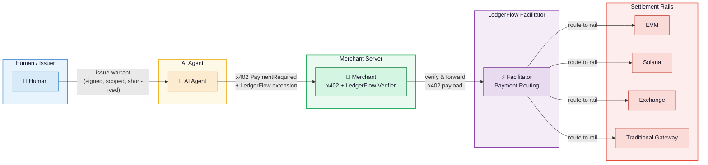

# LedgerFlow

[](https://deepwiki.com/longcipher/ledgerflow)
[](https://context7.com/longcipher/ledgerflow)


**The Missing Authz Layer for x402 AI Payments.**

[Website](https://ledgerflow.longcipher.com/) | [Documentation](https://docs.ledgerflow.longcipher.com/)

LedgerFlow keeps x402 as the merchant and agent wire protocol, adds LedgerFlow authorization through x402 extensions, and routes verified payments to settlement rails through a small Facilitator layer.

## Architecture


```mermaid
flowchart LR
    subgraph issuer["Human / Issuer"]
        I["👤 Human"]
    end

    subgraph agent_layer["AI Agent"]
        A["🤖 AI Agent"]
    end

    subgraph merchant_layer["Merchant Server"]
        M["🏪 Merchant\nx402 + LedgerFlow Verifier"]
    end

    subgraph facilitator_layer["LedgerFlow Facilitator"]
        F["⚡ Facilitator\nPayment Routing"]
    end

    subgraph settlement["Settlement Rails"]
        EVM["EVM"]
        SOL["Solana"]
        EXC["Exchange"]
        FIAT["Traditional Gateway"]
    end

    I -->|"issue warrant\n(signed, scoped, short-lived)"| A
    A -->|"x402 PaymentRequired\n+ LedgerFlow extension"| M
    M -->|"verify & forward\nx402 payload"| F
    F -->|"route to rail"| EVM
    F -->|"route to rail"| SOL
    F -->|"route to rail"| EXC
    F -->|"route to rail"| FIAT

    style issuer fill:#e8f4fd,stroke:#4a90d9,stroke-width:2px,color:#1a1a2e
    style agent_layer fill:#fef9e7,stroke:#f0b429,stroke-width:2px,color:#1a1a2e
    style merchant_layer fill:#eafaf1,stroke:#27ae60,stroke-width:2px,color:#1a1a2e
    style facilitator_layer fill:#f4ecf7,stroke:#8e44ad,stroke-width:2px,color:#1a1a2e
    style settlement fill:#fdedec,stroke:#e74c3c,stroke-width:2px,color:#1a1a2e
    style I fill:#d6eaf8,stroke:#2980b9,color:#1a1a2e
    style A fill:#fdebd0,stroke:#e67e22,color:#1a1a2e
    style M fill:#d5f5e3,stroke:#1e8449,color:#1a1a2e
    style F fill:#e8daef,stroke:#7d3c98,color:#1a1a2e
    style EVM fill:#fadbd8,stroke:#c0392b,color:#1a1a2e
    style SOL fill:#fadbd8,stroke:#c0392b,color:#1a1a2e
    style EXC fill:#fadbd8,stroke:#c0392b,color:#1a1a2e
    style FIAT fill:#fadbd8,stroke:#c0392b,color:#1a1a2e
```

## Workspace Layout

- `crates/ledgerflow-core`: warrant, proof, digest, and constraint verification logic
- `crates/ledgerflow-x402`: x402 challenge and payload extensions, merchant verification, replay protection, and warrant caching
- `crates/ledgerflow-facilitator`: payment-subject resolution and routing to EVM or exchange rails
- `bin/ledgerflow-cli`: development fixtures for sample warrants and payment payloads

## Quick Start

```bash
just test

cargo run -p ledgerflow-cli -- sample-warrant
cargo run -p ledgerflow-cli -- sample-payment
```

## Verification

- `just test` runs the workspace unit and property tests.
- `just bench` benchmarks the `ledgerflow-core` verification hot path with Criterion.
- `just fuzz-check` type-checks the `cargo-fuzz` targets for warrant decoding and x402 extension parsing.
- `just fuzz-smoke` runs one-second fuzzing smoke tests against the warrant and extension decoders.
- `cargo test -p ledgerflow-core` focuses on warrant and proof verification.
- `cargo test -p ledgerflow-facilitator` verifies rail routing.

## Development Notes

- Merchant servers remain x402-only and receive LedgerFlow data via x402 extensions.
- Warrants support inline-first transport and digest-based cache reuse.
- Warrant and LedgerFlow extension fixtures round-trip through deterministic CBOR helpers for fuzzing and fixture generation.
- Replay protection combines `challenge_id + nonce` fingerprinting with payment-identifier idempotency.
- The Facilitator stays rail-agnostic at the merchant boundary while choosing concrete settlement adapters internally.

## License

Apache-2.0
