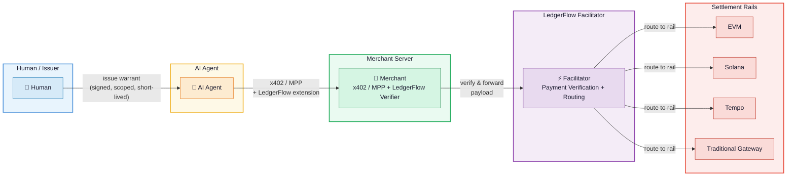

# LedgerFlow

[](https://deepwiki.com/longcipher/ledgerflow)
[](https://context7.com/longcipher/ledgerflow)

**The Missing Authz Layer for x402 AI Payments.**

[Website](https://ledgerflow.longcipher.com/) | [Documentation](https://docs.ledgerflow.longcipher.com/) | [Design Document](docs/design.md)

LedgerFlow is a **self-hostable / SaaS-deployable, protocol-agnostic generic
transaction component**. It keeps x402 and MPP as the merchant↔agent wire
protocols, adds LedgerFlow authorization (warrants, delegation chains, PoP,
approval gates, revocation, trust anchors) through protocol extensions, and
routes verified payments to settlement rails (EVM / Solana / Tempo / Stripe /
traditional gateways) through a small Facilitator layer.

> Design red line: **no coupling to OneCipher and no coupling to LongCipher
> Platform**. Any wallet and any SaaS platform can integrate through standard
> protocols / standard APIs. See [docs/design.md](docs/design.md) for the
> full design.

## Architecture


```mermaid
flowchart LR
    subgraph issuer["Human / Issuer"]
        I["👤 Human"]
    end

    subgraph agent_layer["AI Agent"]
        A["🤖 AI Agent"]
    end

    subgraph merchant_layer["Merchant Server"]
        M["🏪 Merchant\nx402 / MPP + LedgerFlow Verifier"]
    end

    subgraph facilitator_layer["LedgerFlow Facilitator"]
        F["⚡ Facilitator\nPayment Verification + Routing"]
    end

    subgraph settlement["Settlement Rails"]
        EVM["EVM"]
        SOL["Solana"]
        TEMPO["Tempo"]
        FIAT["Traditional Gateway"]
    end

    I -->|"issue warrant\n(signed, scoped, short-lived)"| A
    A -->|"x402 / MPP\n+ LedgerFlow extension"| M
    M -->|"verify & forward\npayload"| F
    F -->|"route to rail"| EVM
    F -->|"route to rail"| SOL
    F -->|"route to rail"| TEMPO
    F -->|"route to rail"| FIAT

    style issuer fill:#e8f4fd,stroke:#4a90d9,stroke-width:2px,color:#1a1a2e
    style agent_layer fill:#fef9e7,stroke:#f0b429,stroke-width:2px,color:#1a1a2e
    style merchant_layer fill:#eafaf1,stroke:#27ae60,stroke-width:2px,color:#1a1a2e
    style facilitator_layer fill:#f4ecf7,stroke:#8e44ad,stroke-width:2px,color:#1a1a2e
    style settlement fill:#fdedec,stroke:#e74c3c,stroke-width:2px,color:#1a1a2e
    style I fill:#d6eaf8,stroke:#2980b9,color:#1a1a2e
    style A fill:#fdebd0,stroke:#e67e22,color:#1a1a2e
    style M fill:#d5f5e3,stroke:#1e8449,color:#1a1a2e
    style F fill:#e8daef,stroke:#7d3c98,color:#1a1a2e
    style EVM fill:#fadbd8,stroke:#c0392b,color:#1a1a2e
    style SOL fill:#fadbd8,stroke:#c0392b,color:#1a1a2e
    style TEMPO fill:#fadbd8,stroke:#c0392b,color:#1a1a2e
    style FIAT fill:#fadbd8,stroke:#c0392b,color:#1a1a2e
```

## Real-Network Test Results

LedgerFlow's protocol stack has been validated against two live testnets with
a real wallet (OneCipher) signing the payment credentials.

### x402 exact (EIP-3009) on Arc Testnet

- **Network**: `https://rpc.testnet.arc.io` (chainId 5042002); native USDC
  with an ERC-20 interface at `0x3600...` (6 decimals; gas token is the
  18-decimal native USDC).
- **Flow**: merchant issues a 402 `PaymentRequired` (advertising
  `scheme=exact, asset=USDC@eip155:5042002, payTo=merchant`) → OneCipher signs
  an EIP-3009 `TransferWithAuthorization` typed-data message → merchant settles
  on-chain via `transferWithAuthorization`.
- **On-chain confirmation**: tx `0x38a531c9...` status=0x1 with both
  `AuthorizationUsed` and `Transfer` (10000 units) events.
- **Signature correctness**: OneCipher's EIP-712 signature is byte-identical
  to `cast wallet sign --data` (`66a4352d...`), proving standards-compliant
  EIP-712 signing.

### MPP charge on Tempo Moderato

- **Network**: `https://rpc.moderato.tempo.xyz` (chainId 42431); escrow
  contract `0xe1c4d3dc...`, pathUSD `0x20c0...`.
- **Flow**: server issues a `WWW-Authenticate: Payment` challenge (realm
  "MPP Payment", intent charge, method tempo) → the client signs a TIP-20
  transfer transaction → the server broadcasts a fee-sponsored transaction
  (Tempo type-0x76 with `feePayerSignature` / `feeToken` / `calls`).
- **On-chain confirmation**: tx `0xa678fb46...` status=0x1, sender is the
  payer account, 3 logs (2× `Transfer` + fee event), pathUSD balance decreased
  by exactly 0.01 + a small fee.

Reusable live-test scripts live in [`testnet-tests/`](testnet-tests/); the
gaps found and fixes applied to the wallet are tracked in
`onecipher/docs/x402-mpp-integration-gaps.md`.

## Workspace Layout

- `crates/ledgerflow-core`: warrant, proof, digest, delegation-chain, approval,
  revocation-seam, and constraint verification logic (pure domain, no I/O)
- `crates/ledgerflow-protocol`: x402 / MPP extension codecs, merchant
  verification middleware, replay protection, and warrant caching
- `crates/ledgerflow-wallet`: `WalletSigner` capability trait + embedded and
  local JSON-RPC signers
- `crates/ledgerflow-facilitator`: payment-verification orchestration,
  revocation store, settlement routing to rails
- `crates/ledgerflow-server`: REST API, webhook, SaaS mode (standalone / saas)
- `bin/ledgerflow-cli`: development fixtures for sample warrants and payment
  payloads
- `bin/ledgerflow-server`: deployable server binary

## Quick Start

```bash
just test

cargo run -p ledgerflow-cli -- sample-warrant
cargo run -p ledgerflow-cli -- sample-payment
```

## Verification

- `just test` runs the workspace unit, property, and integration tests.
- `just mutate` runs mutation testing (`cargo mutants`) to validate test
  quality (TDD + mutation testing only; no BDD).
- `just bench` benchmarks the `ledgerflow-core` verification hot path with
  Criterion.
- `just fuzz-check` type-checks the `cargo-fuzz` targets for warrant decoding
  and protocol-extension parsing.
- `just fuzz-smoke` runs one-second fuzzing smoke tests against the decoders.
- `cargo test -p ledgerflow-core` focuses on warrant, proof, and delegation
  verification.
- `cargo test -p ledgerflow-facilitator` verifies revocation and rail routing.

## Development Notes

- Merchant servers remain x402/MPP-only and receive LedgerFlow data via
  protocol extensions.
- Warrants support inline-first transport and digest-based cache reuse; the
  full delegation chain is transmitted inline in v1.
- Warrant and LedgerFlow extension fixtures round-trip through deterministic
  CBOR helpers for fuzzing and fixture generation.
- Replay protection combines `challenge_id + nonce` fingerprinting with
  payment-identifier idempotency.
- The Facilitator stays rail-agnostic at the merchant boundary while choosing
  concrete settlement adapters internally.
- Revocation is an online security commitment: production deployments MUST
  persist the revocation store; in-memory mode is demo-only with an explicit
  `--insecure-revoc-memory` flag.
- Configuration is fail-fast: an invalid `[saas]` section is a startup error;
  an absent section is an explicit default to standalone.

## License

Apache-2.0
